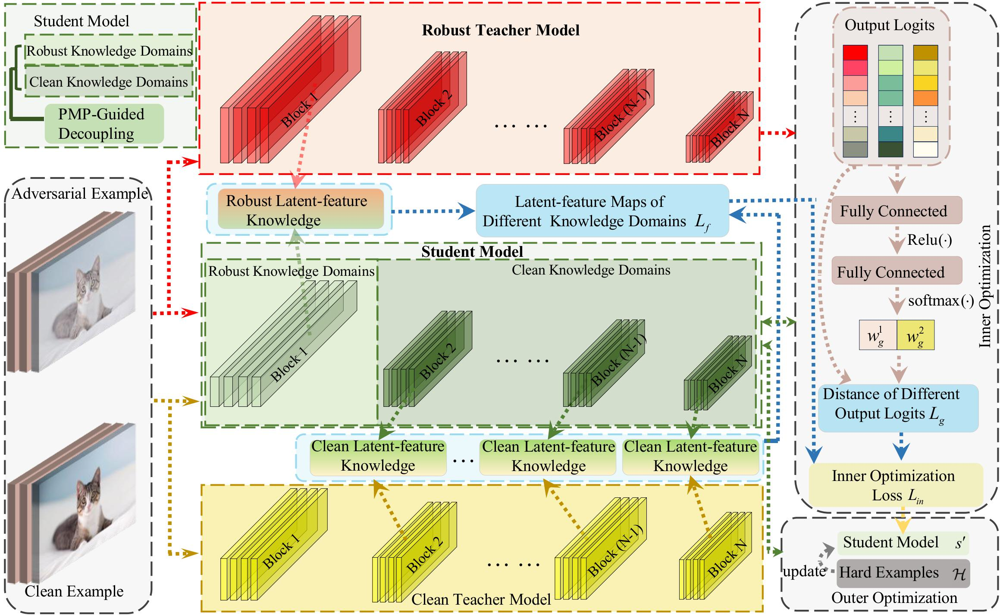

# PMP-MetaDistill
this repo covers the implementation of the following paper:
PMP-MetaDistill: Enhancing Adversarial Robustness of Small Models via Adaptive Multi-Teacher Distillation with PMP-Guided Meta-Learning.



## Installation
To use this repository, please follow the steps below to install the required dependencies.
This repo was tested in A100
## Prerequisites
- Python (version 3.10.13)
- pip (version 24.0)
- CUDA (version 12.4)
## Running
Before distill the student, be sure to get a robust teacher model, you can use the file AT.py to get it.
and you also have a clean teacher model.
```
python AT.py  &&
python pmp_resnet_cifar10.py
```
## Citation
If you use this code in your work, please cite our paper:
```
PMP-MetaDistill: Enhancing Adversarial Robustness of Small Models via Adaptive Multi-Teacher Distillation with PMP-Guided Meta-Learning. (2025).
The Visual Computer. 
```

## Acknowledgement
This research was supported by the National Natural Science Foundation of China under Grant No.62302499
